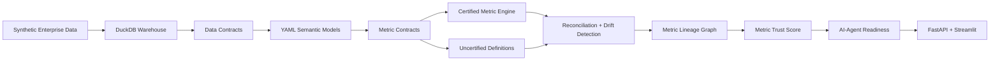
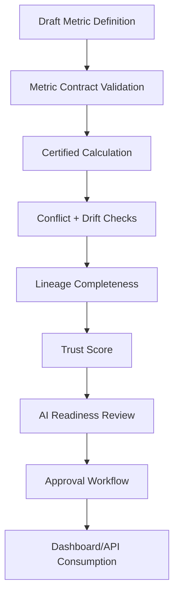

# Enterprise Metrics Trust Layer + Semantic Governance Platform


## Executive Summary

This project demonstrates the analytics engineering and AI data governance mindset: do not just calculate metrics — govern their meaning, prove their lineage, and certify them for safe consumption.

A basic analytics project asks: “Can we build a dashboard?”

This project asks: “Can the business trust the number, understand how it was calculated, trace where it came from, and safely expose it to dashboards and AI agents?”

This project demonstrates the analytics engineering and AI data governance mindset: do not just calculate metrics — govern their meaning, prove their lineage, and certify them for safe consumption.

## Business Problem

Large enterprises rely on metrics such as revenue, churn, active customers, fraud rate, claim approval rate, payment failure rate, gross margin, on-time delivery, and SLA compliance.

But in real companies, those metrics often become inconsistent:

- Finance calculates revenue from booked invoices.
- Sales calculates revenue from closed opportunities.
- Product calculates revenue from successful payments.
- Operations excludes refunds differently.
- Risk excludes suspected fraud.
- AI agents may answer using the wrong table or stale definition.

This creates executive reporting conflicts, audit risk, BI mistrust, duplicated SQL, inconsistent business definitions, unsafe natural-language analytics, and broken downstream data products.

## Project Goal

Build a production-style semantic metrics trust platform that defines governed business metrics, calculates certified metrics consistently, detects conflicting definitions, validates contracts, tracks lineage, scores trustworthiness, exposes metrics through API/dashboard layers, and determines whether each metric is safe for AI-agent use.

## Core Business Question

Can this metric be trusted, explained, traced, versioned, and safely consumed by dashboards, executives, and AI agents?

## Architecture



## Semantic Governance Workflow



## Key Features

- Synthetic enterprise data generation
- DuckDB local analytical warehouse
- YAML-based semantic metric definitions
- Metric contracts and ownership
- Business glossary
- Metric calculation engine
- Certified vs uncertified metric comparison
- Metric drift and conflict detection
- Metric lineage graph
- Metric freshness and quality checks
- Metric trust score
- AI-agent metric readiness score
- Metric approval workflow simulation
- FastAPI service layer
- Streamlit governance dashboard
- Docker support
- GitHub Actions CI
- pytest test coverage

## Business Metrics Governed

The platform governs 15 certified metrics, including `net_revenue`, `gross_revenue`, `active_customers`, `churn_rate`, `customer_retention_rate`, `average_order_value`, `refund_rate`, `payment_success_rate`, `subscription_mrr`, `support_sla_compliance_rate`, `campaign_conversion_rate`, `sales_pipeline_value`, and more.

It also injects intentionally conflicting definitions for net revenue, active customers, churn, payment success, and support SLA compliance to prove the trust layer can detect disagreement.

## Evidence Outputs

- `data/metrics/certified_metric_results.csv`
- `data/metrics/uncertified_metric_results.csv`
- `data/metrics/metric_reconciliation_results.csv`
- `data/lineage/metric_lineage.json`
- `data/scorecards/metric_trust_scorecard.json/csv`
- `data/scorecards/ai_agent_metric_readiness_report.json/csv`
- `data/scorecards/semantic_layer_health_summary.json/csv`
- `data/approvals/metric_approval_history.csv`

## API

Endpoints include:

- `GET /health`
- `GET /metrics`
- `GET /metrics/{metric_name}`
- `GET /metric-results`
- `GET /metric-conflicts`
- `GET /metric-trust-scorecard`
- `GET /ai-agent-readiness`
- `GET /lineage/{metric_name}`
- `GET /data-contracts`
- `GET /metric-contracts`
- `GET /semantic-layer-summary`
- `POST /calculate-metric`
- `POST /request-metric-approval`
- `POST /resolve-conflict`

## Dashboard

The Streamlit dashboard includes Executive Overview, Metric Catalog, Certified vs Uncertified Metrics, Conflict Detection, Trust Scorecard, AI-Agent Readiness, Lineage Explorer, Contract Validation, Approval Workflow, and Semantic Layer Health.

## How To Run

```bash
pip install -r requirements.txt
python -m src.data_generation.generate_enterprise_data
python -m src.pipeline.run_all
python -m pytest
python -m ruff check .
streamlit run src/dashboard/app.py
uvicorn src.api.main:app --reload
```

## Known Limitations

- Synthetic data only
- Local DuckDB instead of enterprise warehouse
- Local YAML semantic layer instead of dbt MetricFlow/Cube
- Deterministic conflict detection rules
- No cloud deployment
- No authentication
- No real BI tool integration
- No real AI agent integration yet

## Future Enhancements

- dbt Semantic Layer / MetricFlow implementation
- Cube semantic layer implementation
- OpenMetadata integration
- OpenLineage/Marquez lineage
- Snowflake/Databricks deployment
- Airflow orchestration
- dbt models and tests
- Great Expectations
- BI integrations with Power BI/Tableau
- AI agent tool-calling interface
- Role-based access control
- Cloud deployment

## STAR Story

### Situation
Enterprise teams often report different values for the same KPI because each team uses different SQL logic, filters, source systems, time windows, and business assumptions.

### Task
Build a semantic metrics trust layer that centralizes metric definitions, validates metric contracts, detects definition drift, calculates certified metrics, tracks lineage, and determines whether metrics are safe for dashboard or AI-agent consumption.

### Action
Created synthetic enterprise source data, YAML metric definitions, a DuckDB warehouse, metric contracts, metric calculation engine, lineage tracking, trust scoring, drift detection, approval workflow simulation, API endpoints, dashboard views, tests, and CI/CD.

### Result
Produced a reproducible portfolio project that demonstrates how enterprise metrics can be governed, certified, explained, and safely consumed across BI tools, executive reporting, and AI systems.

## Project Status

V0.1: Working baseline.
